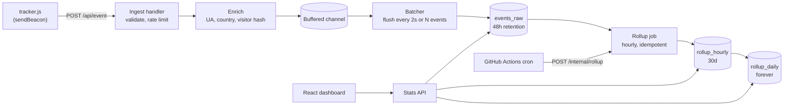

# Mini Plausible: System Design and Build Plan

A cookieless, privacy-first web analytics service. Go backend, React dashboard, Postgres storage, designed to run on free-tier infrastructure.

Working name: `pulse` (rename freely).

---

## 1. Goals and non-goals

**Goals**

- A site owner pastes one `<script>` tag and gets a dashboard: visitors, pageviews, top pages, sources, countries, browsers/OS/devices, and a realtime counter.
- No cookies, no stored IPs, no cross-day tracking of a person. No consent banner needed.
- Runs entirely on free tiers (about 512 MB RAM, about 500 MB Postgres).
- Backend depth: batched ingestion, sessions, rollups, cardinality control, HyperLogLog, graceful shutdown, observability.

**Non-goals (v1)**

- Multi-region or horizontally scaled ingestion (the design assumes one API instance; see section 9).
- Heatmaps, session replay, funnels, or per-user profiles. These conflict with the privacy model.
- Site time zones other than UTC (see section 6.6 for why).

---

## 2. Requirements

### Functional

| # | Requirement |
|---|-------------|
| F1 | Users register and log in; each user owns one or more sites |
| F2 | Each site has a registered domain and a snippet to embed |
| F3 | Tracker sends pageviews (and custom events) to the ingest endpoint |
| F4 | Dashboard shows summary metrics, a time series, and breakdowns by dimension |
| F5 | Realtime view: distinct visitors in the last 5 minutes |
| F6 | Optional public read-only dashboard link per site |
| F7 | Custom events and goals (`pulse.track('signup')`) |

### Non-functional

| # | Requirement |
|---|-------------|
| N1 | Ingest responds in under 10 ms p99 (does no DB work in the request path) |
| N2 | Tracker script under 2 KB gzipped; must never break or slow the host site |
| N3 | Storage bounded: raw events kept 48 hours, hourly rollups 30 days, daily rollups indefinitely |
| N4 | Survives host sleep and restarts with bounded, documented event loss |
| N5 | Resistant to spam events and cardinality blow-ups |

### Free-tier constraints that shape the design

- **Backend sleeps when idle** on free hosts. Mitigate with a free pinger hitting `/healthz`, and accept that a rare event may be lost. Verify the current terms of whichever host you choose.
- **~500 MB database.** Forces short raw retention, rollups, and capped cardinality.
- **Low CPU.** Batch writes, avoid per-request work, keep the GeoIP DB memory-mapped or compact.
- **No always-on worker guarantee.** Scheduled work must be idempotent and triggerable from outside (GitHub Actions cron) as well as by an in-process ticker.

---

## 3. High-level architecture



### Component responsibilities

| Component | Responsibility |
|-----------|----------------|
| **tracker.js** | Collect URL, referrer, screen width; send via `navigator.sendBeacon`; handle SPA route changes; fail silently |
| **Ingest handler** | Validate payload and `Origin`, resolve site by domain, rate limit, drop bots, return `202` |
| **Enricher** | Parse User-Agent, look up country from IP, compute the visitor hash, then discard the IP |
| **Batcher** | Drain the channel into batches and write with `COPY` or multi-row insert; flush on shutdown |
| **Session tracker** | Assign events to sessions (30-minute inactivity window) using an in-memory map with TTL |
| **Rollup job** | Recompute hourly buckets from raw events, merge hours into days, delete expired data |
| **Stats API** | Authenticated queries over rollups (long ranges) and raw events (realtime, recent filters) |
| **Auth** | Email and password, session cookie for the dashboard (this is *your* app, not the tracker) |
| **Dashboard** | React SPA: charts, breakdown tables, site setup, filters |

### Request lifecycle for one pageview

1. Browser fires `sendBeacon` to `POST /api/event`.
2. Handler parses JSON, checks the domain maps to a site and the `Origin` matches.
3. Rate limiter checks per-IP and per-site token buckets.
4. Bot filter checks the User-Agent against a crawler list.
5. Enricher computes visitor ID, country, browser, OS, device.
6. The event is pushed into a buffered channel (non-blocking; if full, increment a `dropped_events` metric and drop).
7. Handler returns `202 Accepted`.
8. Batcher flushes to Postgres within about 2 seconds.

---

## 4. Data model

```sql
-- Accounts and sites
CREATE TABLE users (
  id            BIGSERIAL PRIMARY KEY,
  email         TEXT UNIQUE NOT NULL,
  password_hash TEXT NOT NULL,
  created_at    TIMESTAMPTZ NOT NULL DEFAULT now()
);

CREATE TABLE sites (
  id          BIGSERIAL PRIMARY KEY,
  user_id     BIGINT NOT NULL REFERENCES users(id) ON DELETE CASCADE,
  domain      TEXT UNIQUE NOT NULL,          -- e.g. "example.com" (no scheme)
  public_slug TEXT UNIQUE,                   -- non-null when public dashboard enabled
  created_at  TIMESTAMPTZ NOT NULL DEFAULT now()
);

-- Daily rotating salt for visitor hashing. Rows older than 2 days are deleted.
CREATE TABLE salts (
  day  DATE PRIMARY KEY,
  salt BYTEA NOT NULL
);

-- Raw events: short-lived
CREATE TABLE events_raw (
  id           BIGSERIAL PRIMARY KEY,
  site_id      BIGINT NOT NULL,
  ts           TIMESTAMPTZ NOT NULL,
  visitor_id   BYTEA NOT NULL,               -- 16 bytes, valid within one UTC day only
  session_id   BIGINT NOT NULL,
  name         TEXT NOT NULL,                -- 'pageview' or custom event name
  pathname     TEXT NOT NULL,
  referrer     TEXT,                         -- host only, e.g. "news.ycombinator.com"
  utm_source   TEXT,
  country      CHAR(2),
  browser      TEXT,
  os           TEXT,
  device       TEXT                          -- 'desktop' | 'mobile' | 'tablet'
);
CREATE INDEX events_raw_site_ts ON events_raw (site_id, ts);

-- Rollups: one row per (site, bucket, dimension, value)
-- dimension examples: '_total', 'page', 'referrer', 'country', 'browser', 'os', 'device', 'event'
CREATE TABLE rollup_hourly (
  site_id      BIGINT NOT NULL,
  bucket       TIMESTAMPTZ NOT NULL,         -- truncated to the hour, UTC
  dimension    TEXT NOT NULL,
  value        TEXT NOT NULL,                -- '' for '_total'
  pageviews    INT NOT NULL,
  visits       INT NOT NULL,
  bounces      INT NOT NULL,
  duration_sum BIGINT NOT NULL,              -- seconds, summed over visits
  visitors_hll BYTEA NOT NULL,               -- serialized HyperLogLog sketch
  PRIMARY KEY (site_id, bucket, dimension, value)
);

CREATE TABLE rollup_daily (
  site_id      BIGINT NOT NULL,
  day          DATE NOT NULL,                -- UTC
  dimension    TEXT NOT NULL,
  value        TEXT NOT NULL,
  pageviews    INT NOT NULL,
  visits       INT NOT NULL,
  bounces      INT NOT NULL,
  duration_sum BIGINT NOT NULL,
  visitors     INT NOT NULL,                 -- merged HLL estimate; sketch is dropped
  PRIMARY KEY (site_id, day, dimension, value)
);

-- Tracks rollup progress so the job is resumable
CREATE TABLE rollup_state (
  id              INT PRIMARY KEY DEFAULT 1,
  hourly_through  TIMESTAMPTZ NOT NULL,
  daily_through   DATE NOT NULL
);
```

### Rough storage math (to verify and put in your README)

- Raw row is about 200 to 250 bytes with its index. At 100k events per day across all sites and 48h retention, that is about 200k rows, roughly 50 MB.
- Hourly rollups for one low-traffic site: about 5 dimensions x up to 50 values = 250 rows per hour, mostly small sparse sketches. Measure the real size once you have data.
- Daily rollups are about 100 bytes per row, so they stay tiny.

---

## 5. API design

### Public (called by tracker)

| Method | Path | Notes |
|--------|------|-------|
| `POST` | `/api/event` | Body: `{d, n, u, r, w, p?}` (domain, name, URL, referrer, width, props). Returns `202`. CORS allowed for any origin, but `Origin` must match the site's domain |
| `GET` | `/script.js` | Tracker, long cache headers, versioned filename for cache-busting |

### Dashboard (session-cookie auth)

| Method | Path | Notes |
|--------|------|-------|
| `POST` | `/api/auth/register`, `/login`, `/logout` | |
| `GET` | `/api/auth/me` | |
| `GET` `POST` | `/api/sites` | List or create |
| `GET` `PATCH` `DELETE` | `/api/sites/{id}` | Includes toggling public link |
| `GET` | `/api/sites/{id}/summary?from&to` | Visitors, pageviews, visits, bounce rate, avg duration, with previous-period comparison |
| `GET` | `/api/sites/{id}/timeseries?from&to&interval=hour\|day` | |
| `GET` | `/api/sites/{id}/breakdown?dimension=page&from&to&limit=` | Top N values for a dimension |
| `GET` | `/api/sites/{id}/realtime` | Distinct visitors in last 5 minutes (from raw events) |
| `GET` | `/api/public/{slug}/...` | Same read endpoints, no auth, for shared dashboards |

### Operational

| Method | Path | Notes |
|--------|------|-------|
| `GET` | `/healthz` | Liveness, also used by the keep-awake pinger |
| `GET` | `/metrics` | Prometheus format, protect with a token |
| `POST` | `/internal/rollup` | Triggers the rollup job. Requires a shared secret. Guarded by a Postgres advisory lock so concurrent triggers are safe |

Error format: `{"error": {"code": "...", "message": "..."}}`.

---

## 6. Key design decisions

### 6.1 Cookieless visitor identity

```
visitor_id = first16( HMAC-SHA256(daily_salt, site_id || ip || user_agent) )
```

- The salt rotates at 00:00 UTC and old salts are deleted after 2 days. After deletion, nobody (including you) can link a hash back to a person or across days.
- IP and full User-Agent are used only in memory to compute the hash and are never stored.
- **Consequence:** visitor IDs are only comparable within one UTC day. Unique visitors for a multi-day range is therefore the *sum of daily uniques*. Someone who visits on two days counts twice. State this plainly in the UI docs; it is the trade-off privacy-first tools accept.

### 6.2 Non-blocking ingestion

- Handlers never touch the database. They push to a buffered channel (for example capacity 10,000).
- One batcher goroutine flushes when the batch reaches N events (for example 500) or a timer fires (for example 2 seconds), whichever comes first.
- **Backpressure policy:** if the channel is full, drop the event and increment a counter. Losing analytics under overload is better than slowing the customer's site.
- **Shutdown:** on `SIGTERM`, stop accepting, drain the channel, flush, then exit. Free hosts send `SIGTERM` before stopping an instance, so this covers most restarts. A hard kill can still lose up to about 2 seconds of events; document this.

### 6.3 Sessions

- A visit is a run of events from the same `visitor_id` with gaps under 30 minutes.
- Track active sessions in an in-memory map `(site_id, visitor_id) -> {session_id, last_seen, pageviews, entry_page, started_at}` with TTL eviction.
- A session with exactly one pageview and no custom event is a bounce. Duration is `last_seen - started_at`.
- **Single-instance assumption:** in-memory state means one API instance. Moving to multiple instances would require moving session state to Redis or Postgres. Note this in the README as a deliberate trade-off.
- Sessions break at 00:00 UTC because visitor IDs change with the salt. Accepted.

### 6.4 Rollups (idempotent by construction)

- Every run recomputes complete hourly buckets from raw events and **upserts** them (`INSERT ... ON CONFLICT DO UPDATE`). Running twice yields the same result, so retries and duplicate triggers are harmless.
- Only *closed* hours are rolled up (plus a re-roll of the most recent hour to catch late events).
- Daily rollups merge the 24 hourly rows for a day; the sketch is merged and its estimate stored as an integer.
- Retention cleanup runs after rollup: delete raw events older than 48h, hourly rollups older than 30 days, old salts.
- A visit is attributed to the hour it started in. Bounces are counted when the session is closed, so the job should only count sessions whose window has ended (last event older than 30 minutes).

### 6.5 Cardinality control

Attackers, or just messy sites, can create unbounded distinct values (random query strings, random referrers).

- Normalize URLs: strip query strings and fragments except an allowlist (for example `utm_*`), and lowercase hosts.
- Cap path length (for example 200 chars) and reject events beyond it.
- When writing a bucket, keep the top N values per dimension (for example 50 by pageviews) and fold the rest into a single `(other)` row.
- Enforce a per-site event rate limit so one site cannot exhaust your database.

### 6.6 Unique counts with HyperLogLog

- Each hourly row stores a serialized HyperLogLog sketch of `visitor_id`s. Sketches merge losslessly, so 24 hourly sketches produce one accurate daily count without needing raw events (which are gone after 48h).
- Precision choice: p=12 gives about 1.6% standard error; p=10 is smaller with about 3.3% error. Sparse encoding keeps low-traffic rows very small. Measure row sizes and choose.
- Benchmark to include in your README: generate synthetic visitors, compare HLL estimates against exact `COUNT(DISTINCT)`, and plot error versus cardinality.
- **UTC only in v1.** Daily buckets and salt rotation both follow UTC. Supporting site time zones properly is hard: many zones (for example India at UTC+5:30) do not align with hourly UTC buckets, and the visitor salt would rotate mid local-day. Listed under stretch goals.

### 6.7 Where breakdown filters can (and cannot) come from

Rollup rows are stored per dimension independently, so they can answer "top pages" and "top countries" but not "top pages *for visitors from Germany*."

- **Phase 1 approach:** filters work only on the last 48 hours, computed from raw events.
- **Later option:** add a small composite rollup for a few high-value pairs (for example page x country), or accept the 48h window and label it clearly in the UI.

### 6.8 Abuse and privacy safeguards

- `Origin`/`Referer` must match the site's registered domain (this stops casual spoofing; it is not a security boundary, since non-browser clients can lie).
- Token-bucket rate limits per IP and per site.
- Bot filtering by User-Agent list, and by ignoring requests with no `Origin`.
- Honor `Do Not Track` optionally, and skip localhost origins.
- Passwords hashed with argon2id or bcrypt; dashboard sessions use `HttpOnly`, `SameSite=Lax`, `Secure` cookies; CSRF protection on state-changing routes.

---

## 7. Tracker script sketch

Requirements: tiny, async, no dependencies, silent failure.

```js
(function () {
  var s = document.currentScript;
  var domain = s.getAttribute('data-domain');
  var api = new URL(s.src).origin + '/api/event';

  function send(name, props) {
    var body = JSON.stringify({
      d: domain, n: name || 'pageview',
      u: location.href, r: document.referrer,
      w: innerWidth, p: props
    });
    try {
      if (!navigator.sendBeacon(api, new Blob([body], { type: 'text/plain' }))) throw 0;
    } catch (e) {
      fetch(api, { method: 'POST', body: body, keepalive: true }).catch(function () {});
    }
  }

  // SPA support
  var push = history.pushState;
  history.pushState = function () { push.apply(this, arguments); send(); };
  addEventListener('popstate', function () { send(); });

  window.pulse = { track: send };
  send();
})();
```

Note: send the body as `text/plain` so the request stays a CORS "simple request" and avoids a preflight.

---

## 8. Suggested repository layout

```
pulse/
  cmd/
    server/main.go            # wiring, config, graceful shutdown
  internal/
    config/                   # env parsing
    httpapi/                  # routers, middleware, handlers
    auth/                     # password hashing, sessions
    ingest/                   # validation, enrich, buffer, batcher
    enrich/                   # UA parsing, geo lookup, visitor hash, bot list
    sessions/                 # in-memory session tracker
    rollup/                   # hourly/daily jobs, HLL helpers, retention
    stats/                    # query layer for the dashboard API
    store/                    # sqlc-generated code, migrations runner
    metrics/                  # Prometheus collectors
  migrations/                 # golang-migrate SQL files
  web/                        # React + TypeScript + Vite
  tracker/                    # tracker.js source and build script
  deploy/                     # Dockerfile, docker-compose.yml, render config
  docs/                       # architecture, decisions, benchmarks
  loadtest/                   # k6 scripts
  .github/workflows/          # CI, scheduled rollup trigger
```

**Stack:** Go (chi, pgx, sqlc, golang-migrate, `log/slog`), Postgres (Neon or Supabase in production), React + TypeScript + Vite, TanStack Query, Recharts, Tailwind, Docker Compose for local, GitHub Actions for CI.

---

## 9. Deployment (free-tier plan)

| Piece | Where | Notes |
|-------|-------|-------|
| Dashboard (static build) | Cloudflare Pages, Netlify, or Vercel | Free static hosting |
| Go API | A free container host (for example Render) | Sleeps when idle; verify current limits |
| Postgres | Neon or Supabase free tier | Avoid databases with short expiry |
| Keep-awake ping | cron-job.org hitting `/healthz` | Also useful as uptime monitoring |
| Rollup trigger | GitHub Actions cron hitting `/internal/rollup` | Backs up the in-process ticker |
| GeoIP data | DB-IP Lite or MaxMind GeoLite2 | Country-level only; bundle into the image or download at build |

Free-tier offerings change often. Re-check limits before deploying and note the date you verified in your README.

Scaling notes for the README: the ingest path is stateless apart from sessions. To scale out, move sessions to Redis, keep the batcher per instance, and rely on the advisory lock so only one instance runs rollups.

---

## 10. Observability and testing

**Metrics** (Prometheus): `events_received_total`, `events_dropped_total{reason}`, `batch_flush_duration_seconds`, `batch_size`, `buffer_depth`, `rollup_duration_seconds`, `rollup_last_success_timestamp`, HTTP request duration by route.

**Logging:** structured `slog` with request IDs; never log IPs or full User-Agents.

**Testing strategy**

- Unit: visitor hashing, URL normalization, session logic (table-driven, fake clock), cardinality capping.
- Integration: Postgres via `testcontainers-go`; ingest to raw to rollup to API round trip.
- Property/idempotency: run the rollup twice and assert identical results.
- Benchmarks: `go test -bench` for batch insert strategies and HLL merge.
- Load: k6 against `/api/event`, reporting sustained events/sec and p99 latency on the smallest instance.

---

## 11. Build plan: phases and commit-sized steps

Each phase ends with something runnable, so you always have a working project. Each checkbox is roughly one commit. Sizes are rough: **S** is an evening, **M** is a weekend, **L** is a few sessions.

### Phase 0: Foundation (S)

*Learn: Go module layout, config handling, migrations.*

- [ ] `git init`, `go mod init`, README with the goal and this design doc in `docs/`
- [ ] `docker-compose.yml` with Postgres and a `make up` target
- [ ] Config loader from env vars with validation
- [ ] golang-migrate wired in; first migration creates `users` and `sites`
- [ ] Basic CI workflow: `go vet`, `go test`, `golangci-lint`

**Done when:** `make up && go run ./cmd/server` starts and connects to the database.

### Phase 1: HTTP skeleton (S)

*Learn: chi middleware, graceful shutdown, structured logging.*

- [ ] chi router with `/healthz`
- [ ] `slog` JSON logger and request-ID middleware
- [ ] Panic-recovery and request-logging middleware
- [ ] Graceful shutdown on `SIGINT`/`SIGTERM` with a context timeout
- [ ] Integration test for `/healthz`

**Done when:** `curl /healthz` works and Ctrl-C shuts down cleanly.

### Phase 2: Accounts and sites (M)

*Learn: password hashing, session cookies, CSRF, sqlc.*

- [ ] Set up sqlc; generate queries for users and sites
- [ ] `POST /api/auth/register` with argon2id hashing
- [ ] `POST /api/auth/login` and `logout` with a server-side session table
- [ ] Auth middleware and `GET /api/auth/me`
- [ ] Sites CRUD endpoints, scoped to the owner
- [ ] Domain validation and normalization (`https://www.Example.com/` becomes `example.com`)
- [ ] Tests for auth and ownership checks

**Done when:** you can register, log in, and create a site via curl.

### Phase 3: Tracker and naive ingestion (M)

*Learn: CORS, `sendBeacon`, browser quirks.*

- [ ] `events_raw` migration
- [ ] `POST /api/event` inserts synchronously (yes, naive on purpose)
- [ ] Payload validation and URL parsing into pathname and referrer host
- [ ] `Origin` check against the site's domain
- [ ] Tracker script and `GET /script.js` with cache headers
- [ ] A local `demo.html` page to test the tracker end to end
- [ ] Handler test for valid, invalid, and mismatched-origin events

**Done when:** loading `demo.html` produces rows in `events_raw`.

> Keep this naive version. In Phase 6 you will benchmark it against the batched one, which makes a great README chart.

### Phase 4: Dashboard v1 (M)

*Learn: TanStack Query, Recharts, Vite proxy, typed API clients.*

- [ ] Vite + React + TypeScript app with Tailwind
- [ ] Login and register pages; auth context
- [ ] Site list and "add site" flow with a copy-paste snippet
- [ ] `stats` package: summary, timeseries, and breakdown queries directly over `events_raw`
- [ ] Stats endpoints
- [ ] Dashboard page: totals, line chart, top pages and referrers tables
- [ ] Date range picker (today, 7d, 30d)

**Done when:** you can watch your own demo page's traffic appear on the dashboard.

### Phase 5: Enrichment and privacy (M)

*Learn: HMAC, privacy engineering, in-memory lookups.*

- [ ] `salts` table and daily salt rotation (create-on-demand, delete after 2 days)
- [ ] Visitor hash function with unit tests (same inputs give same ID; different day gives different ID)
- [ ] UA parsing into browser, OS, device
- [ ] Country lookup from a GeoIP database; IP discarded immediately after
- [ ] Bot filtering by User-Agent list
- [ ] URL normalization and length caps
- [ ] Add columns to `events_raw` and expose new breakdown dimensions in the API and UI

**Done when:** the dashboard shows countries, browsers, and unique visitors, and no IPs exist anywhere in the database.

### Phase 6: Batched ingestion pipeline (M)

*Learn: channels, goroutine lifecycle, backpressure, benchmarking.*

- [ ] Buffered channel plus batcher goroutine (size and time triggers)
- [ ] Bulk insert with `pgx.CopyFrom`
- [ ] Non-blocking enqueue with drop-and-count on a full buffer
- [ ] Drain and flush on shutdown; test that no events are lost on graceful stop
- [ ] Prometheus metrics for buffer depth, drops, and flush timing
- [ ] Benchmark: synchronous versus batched inserts (record results in `docs/benchmarks.md`)

**Done when:** ingest latency is flat under load and the benchmark shows the speedup.

### Phase 7: Sessions (M)

*Learn: time-based state, TTL eviction, fake clocks for testing.*

- [ ] Session tracker with 30-minute inactivity window (in-memory, mutex or sharded)
- [ ] Assign `session_id` in the enrich step
- [ ] Background eviction of stale sessions
- [ ] Table-driven tests with an injectable clock (session boundaries, midnight salt change)
- [ ] Compute visits, bounce rate, and average duration in stats queries

**Done when:** the dashboard shows bounce rate and visit duration that match manual testing.

### Phase 8: Rollups and retention (L)

*Learn: idempotent jobs, upserts, advisory locks, retention design.*

- [ ] Rollup migrations (`rollup_hourly`, `rollup_daily`, `rollup_state`)
- [ ] Hourly rollup computed from raw events with `INSERT ... ON CONFLICT DO UPDATE`
- [ ] Cardinality cap with `(other)` folding
- [ ] Idempotency test: run twice, compare results
- [ ] Advisory lock around the job
- [ ] `POST /internal/rollup` with a shared-secret check
- [ ] In-process ticker as well as the endpoint
- [ ] Retention cleanup (raw 48h, hourly 30d, salts)
- [ ] Switch stats endpoints to read rollups for ranges beyond 48h, raw for realtime
- [ ] Integration test for the full raw to rollup to API path

**Done when:** you can delete raw events and the dashboard still shows historical data.

### Phase 9: HyperLogLog for uniques (M)

*Learn: probabilistic data structures, mergeable sketches, serialization.*

- [ ] Add an HLL library (or implement your own for extra learning)
- [ ] Store per-row sketches in `rollup_hourly.visitors_hll`
- [ ] Merge 24 hourly sketches into `rollup_daily.visitors`
- [ ] Multi-day uniques as the sum of daily uniques, with UI copy explaining it
- [ ] Accuracy benchmark: HLL versus exact `COUNT(DISTINCT)`, error versus cardinality chart
- [ ] Measure sketch sizes and pick the precision; record in `docs/decisions.md`

**Done when:** rollup-based unique counts are within a few percent of exact counts in your benchmark.

### Phase 10: Dashboard v2 (M)

*Learn: state management for filters, real-time polling, UX polish.*

- [ ] Realtime endpoint and "current visitors" badge (poll every 10s or use SSE)
- [ ] Click-to-filter on breakdown rows (limited to last 48h, labeled in UI)
- [ ] Comparison with the previous period and percent-change badges
- [ ] Custom events and goals: `pulse.track()` support in the tracker and an events panel
- [ ] Public dashboard toggle and shareable link
- [ ] Loading, empty ("waiting for first event"), and error states
- [ ] Dark mode and mobile layout

**Done when:** a stranger could set up a site and understand the dashboard without help.

### Phase 11: Hardening (M)

*Learn: rate limiting algorithms, security basics.*

- [ ] Token-bucket rate limiter per IP and per site (in memory)
- [ ] Request size limits and stricter validation
- [ ] CSRF protection and secure cookie flags
- [ ] `/metrics` behind a token; dashboards for your own metrics (optional Grafana Cloud free tier)
- [ ] Fuzz or property tests on URL normalization
- [ ] Threat-model notes in `docs/security.md`

**Done when:** you can describe how the service behaves under spam, oversized payloads, and bad origins.

### Phase 12: Deploy and operate (M)

*Learn: containerization, CI/CD, running a real service.*

- [ ] Multi-stage `Dockerfile` (small final image)
- [ ] Frontend build deployed to a static host
- [ ] API deployed to a free container host; database on Neon or Supabase
- [ ] Environment configuration and secrets set up properly
- [ ] GitHub Actions: CI on PRs, deploy on merge to `main`
- [ ] Keep-awake pinger and scheduled rollup workflow
- [ ] Dogfood: install the tracker on your portfolio or blog

**Done when:** the live URL collects real traffic from your own site.

### Phase 13: Prove it and package it (M)

*Learn: load testing, writing about engineering decisions.*

- [ ] k6 load test; report events/sec and p99 latency on the smallest instance
- [ ] Storage report: measured MB per 100k events, raw and rolled up
- [ ] `docs/architecture.md` with the diagram and request lifecycle
- [ ] `docs/decisions.md`: cookieless hashing, sessions in memory, HLL, retention, UTC-only
- [ ] README with screenshots, a one-command `docker compose up`, and a live demo link
- [ ] Seeded demo site with generated traffic for visitors to explore
- [ ] Tag `v1.0.0`

**Done when:** a recruiter can understand the project in five minutes from the README alone.

### Stretch goals (pick by interest)

- Site time zones (design around 15-minute buckets or compute local-day rollups before raw expiry)
- Composite rollups for cross-dimension filters
- Weekly email reports using a GitHub Actions cron and a free email tier
- Redis-backed sessions and a multi-instance story
- CSV export and a read-only stats API with API keys
- Outbound-link and file-download auto-tracking
- Import from Google Analytics exports
- Terraform or a one-click deploy template

---

## 12. Risks and open questions

| Risk | Mitigation |
|------|------------|
| Free host sleeps and drops early events | Keep-awake pinger, `sendBeacon` fire-and-forget, document the trade-off |
| Free-tier terms change | Re-verify before deploying; keep the app container-portable; date-stamp your README |
| Database fills up | Cardinality caps, short raw retention, storage report, alert on table sizes |
| Ad-blockers block the tracker | Support proxying the script through the customer's own path |
| In-memory sessions lost on restart | Accept small inaccuracy (some visits split in two); document it |
| GeoIP licensing | Use DB-IP Lite or GeoLite2 and follow their attribution and license terms |

**Decisions to make as you go** (record each in `docs/decisions.md`): HLL precision, Postgres partitioning versus `DELETE` for raw retention, `text/plain` beacons versus JSON with preflight, whether to build HLL yourself or use a library.
